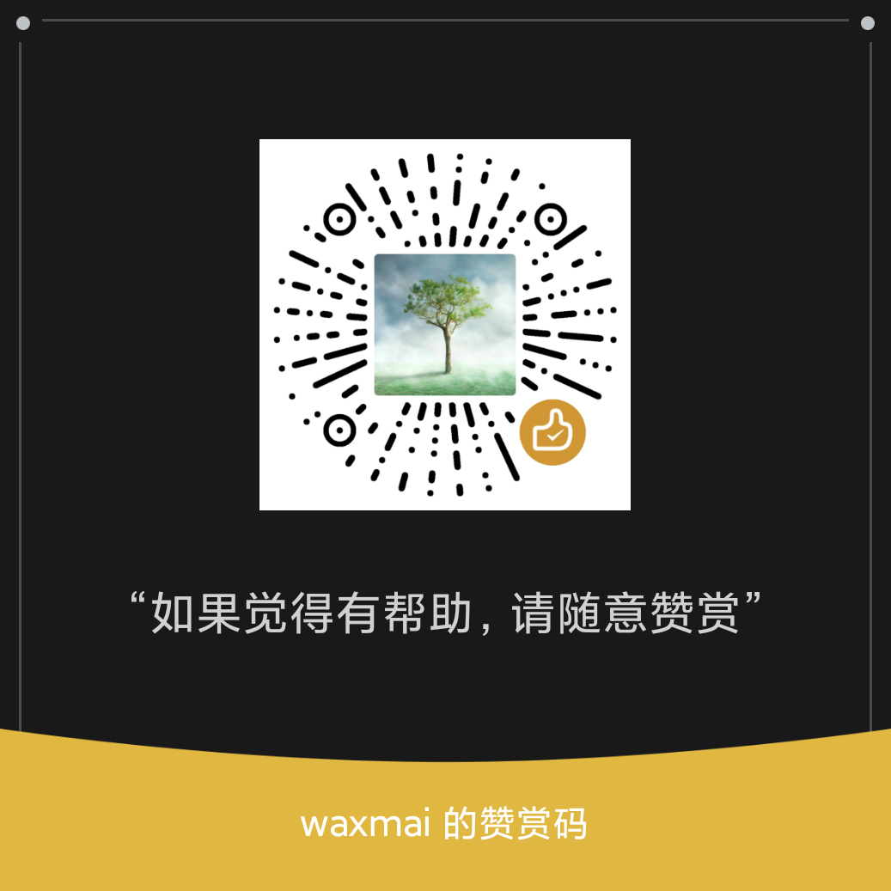

# edu-schedule-system

面向教培机构的教务排课与运营管理系统。项目覆盖学员、课程、课时包、缴费、排课、上课记录、调课补课、账号安全、审计日志、备份恢复与基础运维治理，适合作为中小型培训机构的内部教务后台或 Go + Vue 全栈业务系统参考实现。

> 当前定位：可用于受控环境试运行 / 小规模真实业务使用；如果要直接面向公网大规模商用，仍建议补齐更完整的会话治理、细粒度权限、集中告警与运维体系。

## 功能特性

### 教务与运营

- 学员管理：学员档案、列表筛选、业务状态维护
- 课程管理：课程信息、课程别名与基础查询
- 课时包管理：购课、课时余额、课包状态与业务校验
- 缴费管理：缴费记录、实收统计、管理员写入权限控制
- 排课管理：排课创建、冲突校验、请假、取消、补课、调课
- 上课记录：上课完成与课时扣减绑定，避免课时与记录不一致
- 仪表盘：关键运营数据聚合展示

### 账号、安全与权限

- 正式账号密码登录
- `/auth/me` 会话恢复
- 首次登录强制改密
- logout token revoke
- refresh token rotation 最小实现
- 登录失败计数与临时锁定
- 管理员创建、编辑、禁用、解锁、重置用户密码
- 平台 / 机构 / 校区 / 教师多层角色边界
- `admin` / `teacher` 最小 RBAC，缴费写操作仅管理员可执行

### 审计、可观测与运维

- 关键写操作审计日志
- 审计日志查询与 CSV 导出
- 找回密码验证码发送链路：placeholder / disabled / email
- 恢复发送失败事件落盘与平台查询页
- `/system/health`、`/system/ready` 健康与就绪检查
- Prometheus metrics
- 数据库备份、恢复、恢复演练脚本
- 迁移检查、生产 readiness check、发布 runbook

### 前端体验

- Vue 3 + Element Plus 管理后台
- 路由级懒加载与 vendor chunk 拆分
- 登录、改密、系统用户、学员、课程、课时包、缴费、排课、上课记录、调补课、仪表盘等页面
- 高频表单从手填 ID 逐步收敛为选择式交互
- 统一错误反馈、确认弹窗与密码弹窗宿主

## 技术栈

### 后端

- Go 1.24
- Gin
- GORM / gorm.io/gen
- MySQL 8.x
- Redis，可在本地开发中关闭
- Wire 依赖注入
- Viper 配置管理
- Zap 日志
- Prometheus metrics
- Swagger / OpenAPI

### 前端

- Vue 3
- TypeScript
- Vite
- Vue Router
- Pinia
- Element Plus
- Axios
- ECharts

### 工程化

- Docker / Docker Compose
- Makefile 统一开发命令
- SQL migrations
- Swagger 生成
- Wire 生成
- GitHub Actions production gate
- 备份恢复与 smoke/e2e 脚本

## 仓库结构

```text
.
├── cmd/                    # server、migrate、代码生成与辅助命令
├── configs/                # dev/fat/uat/pro 配置模板
├── docs/                   # 接口、部署、发布、验收、运维与业务文档
├── frontend/web/           # Vue 3 管理后台
├── internal/
│   ├── api/                # HTTP handler 与路由
│   ├── router/             # Gin 路由注册
│   ├── service/            # 业务逻辑
│   ├── repository/         # MySQL DAO / model
│   ├── metrics/            # 指标
│   └── alert/              # 告警规则
├── migrations/             # 数据库迁移与 bootstrap seed
├── scripts/                # 构建、迁移、备份、恢复、smoke、压测脚本
├── docker-compose.yml
├── Dockerfile
├── Makefile
└── README.md
```

## 快速开始

### 环境要求

- Go 1.24.x
- Node.js 20+，建议使用当前 LTS
- npm
- Docker 与 Docker Compose
- MySQL 8.x，如使用 Docker Compose 可自动启动
- Redis 6.x+，本地开发可关闭

### 1. 克隆仓库

```bash
git clone https://github.com/<your-org>/edu-schedule-system.git
cd edu-schedule-system
```

### 2. 准备本地配置

```bash
cp .env.example .env
make env-check
```

`.env.example` 已提供本地开发默认值。真实部署时必须通过环境变量或密钥管理系统覆盖敏感配置，尤其是：

- `JWT_SECRET`
- `MYSQL_READ_*` / `MYSQL_WRITE_*`
- `AUTH_RECOVERY_DELIVERY_EMAIL_PASSWORD`
- CORS 白名单

### 3. 启动本地 MySQL

```bash
make mysql-up
```

如果不使用 Docker Compose，请自行创建数据库和账号：

```sql
CREATE DATABASE IF NOT EXISTS `edu-schedule-system` DEFAULT CHARACTER SET utf8mb4;
CREATE USER IF NOT EXISTS 'app'@'%' IDENTIFIED BY 'app';
GRANT ALL PRIVILEGES ON `edu-schedule-system`.* TO 'app'@'%';
FLUSH PRIVILEGES;
```

### 4. 执行迁移与初始化账号

`make bootstrap` 支持传入 4 个 bootstrap 账号的明文初始密码，迁移进程会在本地生成 bcrypt hash 后写入数据库：

```bash
make bootstrap \
  BOOTSTRAP_PLATFORM_ADMIN_PASSWORD='PlatformInit123!' \
  BOOTSTRAP_ORG_ADMIN_PASSWORD='OrgInit123!' \
  BOOTSTRAP_CAMPUS_ADMIN_PASSWORD='CampusInit123!' \
  BOOTSTRAP_TEACHER_PASSWORD='TeacherInit123!'
```

如需由外部密钥系统预先生成 hash，也可以改传对应的 `BOOTSTRAP_*_PASSWORD_HASH` 变量。

也可以直接运行迁移命令：

```bash
BOOTSTRAP_PLATFORM_ADMIN_PASSWORD='PlatformInit123!' \
BOOTSTRAP_ORG_ADMIN_PASSWORD='OrgInit123!' \
BOOTSTRAP_CAMPUS_ADMIN_PASSWORD='CampusInit123!' \
BOOTSTRAP_TEACHER_PASSWORD='TeacherInit123!' \
go run ./cmd/migrate -env dev -bootstrap
```

初始化后首次登录会强制改密。请不要在共享环境或生产环境使用示例密码。

### 5. 启动后端

```bash
make local-run
```

默认地址：

- API: `http://127.0.0.1:9999`
- Health: `http://127.0.0.1:9999/system/health`
- Ready: `http://127.0.0.1:9999/system/ready`
- Swagger: `http://127.0.0.1:9999/swagger/index.html`，需要 `SWAGGER_ENABLED=true` 且非 `pro` 环境
- Metrics: `http://127.0.0.1:9999/metrics`，需要 `METRICS_ENABLED=true`

### 6. 启动前端

```bash
cd frontend/web
npm install
npm run dev
```

默认 Vite 地址通常为：

```text
http://127.0.0.1:5173
```

如果本地出现旧代码缓存、端口占用或 Vite 解析异常，可回到仓库根目录执行：

```bash
./scripts/frontend_reset_and_dev.sh
```

## Docker Compose 一键启动

```bash
make docker-run
```

Compose 会启动：

- API: `9999`
- MySQL: `3306`
- Redis: `6379`
- Prometheus: `9090`

如需注入初始化密码：

```bash
BOOTSTRAP_PLATFORM_ADMIN_PASSWORD='PlatformInit123!' \
BOOTSTRAP_ORG_ADMIN_PASSWORD='OrgInit123!' \
BOOTSTRAP_CAMPUS_ADMIN_PASSWORD='CampusInit123!' \
BOOTSTRAP_TEACHER_PASSWORD='TeacherInit123!' \
make docker-run
```

Docker Compose 的 `migrate` 服务支持上述明文变量，并会在容器内生成对应 hash。

## 常用命令

```bash
make help                    # 查看命令说明
make env-check               # 校验有效配置
make local-run               # 启动本地后端
make build                   # 构建后端二进制
make test                    # go test ./... -cover
make ci                      # 本地 CI：vet/test/build/generated/frontend/migration/readiness
make frontend-build          # 前端安装与构建检查
make generated-check         # 校验 Wire / Swagger 生成产物无漂移
make migration-lint          # 迁移文件与高风险 SQL 检查
make migration-smoke         # 迁移与 bootstrap 幂等性检查
make server-smoke            # 启动 API 并检查 health/ready
make smoke-e2e               # 登录、改密、RBAC、logout 等主链冒烟
make prod-readiness-check    # 生产配置安全与 readiness gate
make backup                  # 创建 MySQL 备份
make backup-healthcheck      # 检查备份新鲜度与磁盘空间
make restore BACKUP_FILE=... # 恢复备份
make docker-build            # 构建 Docker 镜像
make docker-run              # 启动 compose 本地栈
```

## 配置说明

配置加载优先级：

1. `-config` 参数
2. `CONFIG_PATH` 环境变量
3. `configs/{env}_configs.toml`

`-env` 支持：

- `dev`：本地开发
- `fat`：功能联调
- `uat`：验收测试
- `pro`：生产

常用环境变量示例：

```bash
JWT_SECRET=change-me
MYSQL_READ_ADDR=127.0.0.1:3306
MYSQL_READ_USER=app
MYSQL_READ_PASS=app
MYSQL_READ_NAME=edu-schedule-system
MYSQL_WRITE_ADDR=127.0.0.1:3306
MYSQL_WRITE_USER=app
MYSQL_WRITE_PASS=app
MYSQL_WRITE_NAME=edu-schedule-system
REDIS_ENABLED=false
AUTH_MODE=required
AUTH_TEMPLATE_TOKEN_ENABLED=false
CORS_ALLOWED_ORIGINS=http://127.0.0.1:5173,http://localhost:5173
```

生产环境建议至少满足：

- `AUTH_MODE=required`
- `AUTH_TEMPLATE_TOKEN_ENABLED=false`
- `AUTH_RECOVERY_DELIVERY_MODE` 不得为 `placeholder`
- 禁止暴露 Swagger / pprof
- 明确 CORS 白名单
- 使用正式密钥管理与数据库备份策略
- 接入 Prometheus 与告警平台
- 上线前完成一次备份恢复演练

更多部署细节见 [`docs/DEPLOYMENT.md`](docs/DEPLOYMENT.md) 与 [`docs/RELEASE_RUNBOOK.md`](docs/RELEASE_RUNBOOK.md)。

## API 文档

- Swagger JSON: [`docs/swagger.json`](docs/swagger.json)
- Swagger YAML: [`docs/swagger.yaml`](docs/swagger.yaml)
- 接口设计文档：[`docs/api/接口设计文档.md`](docs/api/接口设计文档.md)

本地启动并开启 Swagger 后访问：

```text
http://127.0.0.1:9999/swagger/index.html
```

## 数据库迁移与代码生成

新增业务表的推荐流程：

```bash
make new-migration TABLE=course
# 修改生成的 SQL migration
make gen-module TABLE=course DSN='app:app@tcp(127.0.0.1:3306)/edu-schedule-system?charset=utf8mb4&parseTime=True&loc=Local' APPLY_MIGRATIONS=true
make generated-check
make test
```

注意：不要手改以下生成产物，应该通过命令重新生成：

- `internal/api/*/*_handler.gen.go`
- `internal/api/*/*_routers.gen.go`
- `internal/repository/mysql/{dao,model}/*.gen.go`
- `cmd/server/wire_gen.go`
- `docs/docs.go`
- `docs/swagger.json`
- `docs/swagger.yaml`

更多说明见：

- [`docs/MIGRATIONS.md`](docs/MIGRATIONS.md)
- [`docs/MODULE_EXAMPLE.md`](docs/MODULE_EXAMPLE.md)
- [`docs/MODULE_CHECKLIST.md`](docs/MODULE_CHECKLIST.md)

## 验证与发布建议

提交前建议至少执行：

```bash
make ci
make lint
make env-check
make generated-check
```

试发布前建议补跑：

```bash
make server-smoke
make smoke-e2e
./scripts/loadtest_core_api.sh
```

如果涉及数据库迁移、账号初始化、备份恢复或生产配置，请额外检查：

```bash
make migration-smoke
make backup-healthcheck
make prod-readiness-check
```

当前项目已有受控发布验收结论，详见 [`docs/final-acceptance-report.md`](docs/final-acceptance-report.md)。

## 文档索引

- 部署说明：[`docs/DEPLOYMENT.md`](docs/DEPLOYMENT.md)
- 发布手册：[`docs/RELEASE_RUNBOOK.md`](docs/RELEASE_RUNBOOK.md)
- 开发约定：[`docs/DEVELOPMENT.md`](docs/DEVELOPMENT.md)
- 认证与授权：[`docs/AUTHORIZATION.md`](docs/AUTHORIZATION.md)
- 权限矩阵：[`docs/PERMISSION_MATRIX.md`](docs/PERMISSION_MATRIX.md)
- 可观测性：[`docs/OBSERVABILITY.md`](docs/OBSERVABILITY.md)
- 备份恢复演练：[`docs/DB_RESTORE_DRILL.md`](docs/DB_RESTORE_DRILL.md)
- 数据修复手册：[`docs/DATA_REPAIR_PLAYBOOK.md`](docs/DATA_REPAIR_PLAYBOOK.md)
- 容量基线：[`docs/CAPACITY_BASELINE.md`](docs/CAPACITY_BASELINE.md)
- 前端性能：[`docs/FRONTEND_PERFORMANCE.md`](docs/FRONTEND_PERFORMANCE.md)
- SaaS 运营治理：[`docs/SAAS_OPERATIONS.md`](docs/SAAS_OPERATIONS.md)
- 最终验收报告：[`docs/final-acceptance-report.md`](docs/final-acceptance-report.md)

## 安全提示

- 不要提交真实 `.env`、数据库备份、私钥、SMTP 密码或生产 JWT secret
- 生产环境禁止使用示例密码与默认开发密钥
- 生产环境禁止开启模板 Token 端点
- 生产环境必须显式配置 CORS 白名单
- 迁移生产数据库前必须先备份，并保留可恢复证据
- 找回密码邮件通道应使用专门账号，不要混用个人邮箱
- 开源前建议再次检查 git 历史、日志文件和备份目录，确认没有敏感数据

## 贡献

欢迎提交 Issue 和 Pull Request。建议 PR 至少包含：

1. 问题背景或需求说明
2. 关键实现说明
3. 已执行的验证命令与结果
4. 如涉及接口或配置变更，同步更新文档

本项目偏业务系统工程实践，提交时请优先保证：

- 迁移可重复执行或有明确兼容策略
- 生成产物无漂移
- 权限边界清晰
- 关键业务链路有测试或 smoke 证据

## License

This project is licensed under the MIT License. See [`LICENSE`](LICENSE) for details.

## Vibe Coding

本项目是纯 Vibe Coding 项目。如果这个项目对你有帮助，欢迎点一个 Star，也可以随意赞赏支持一下。


